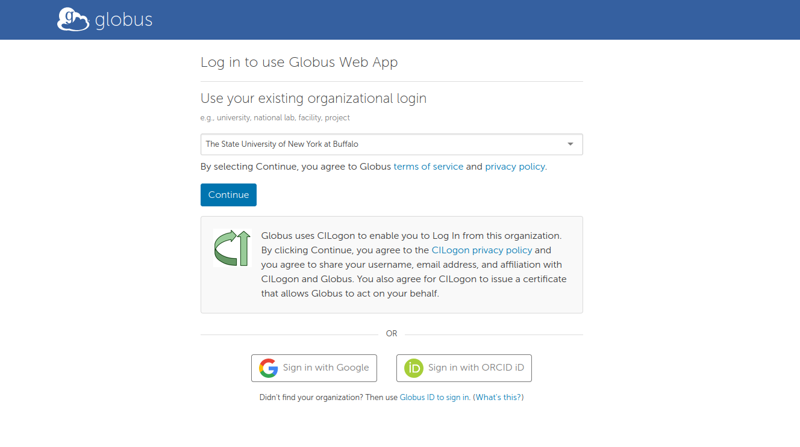
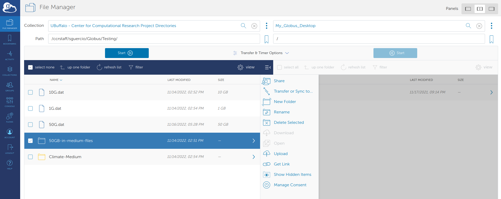
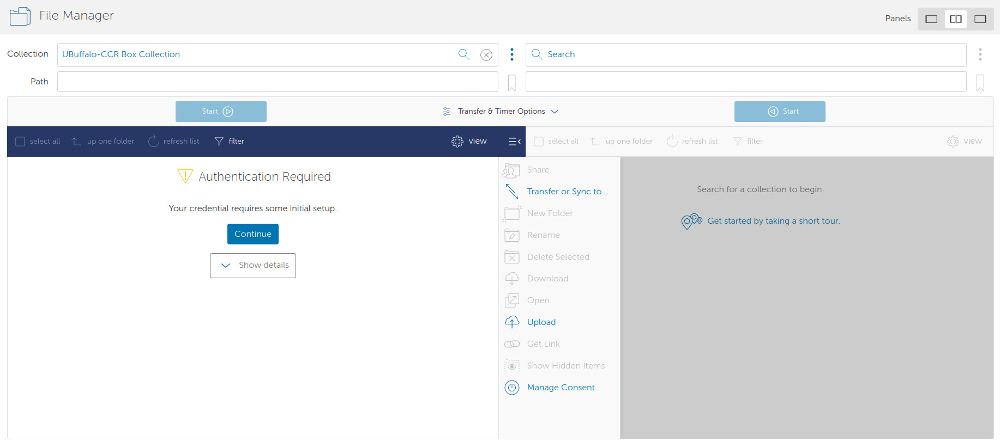
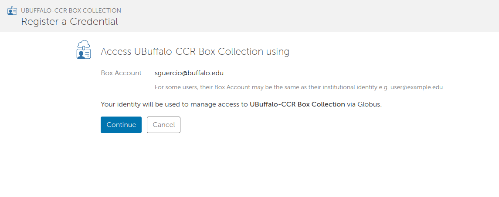
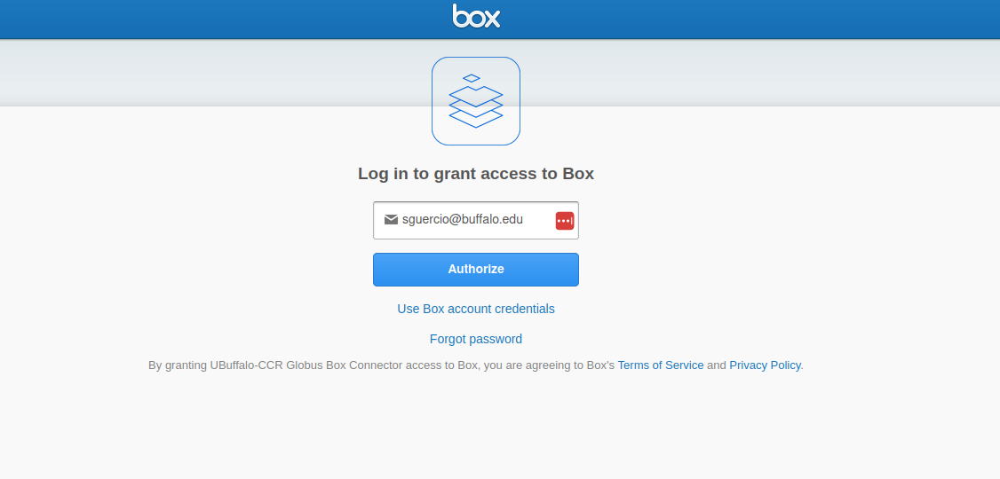
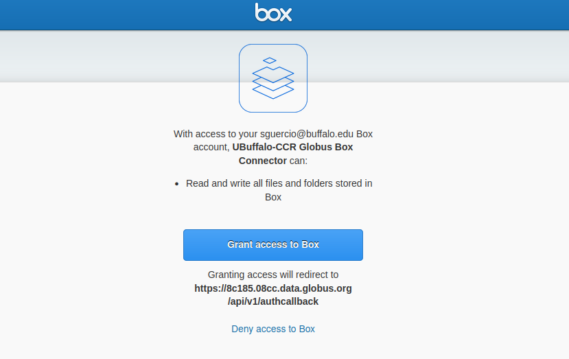
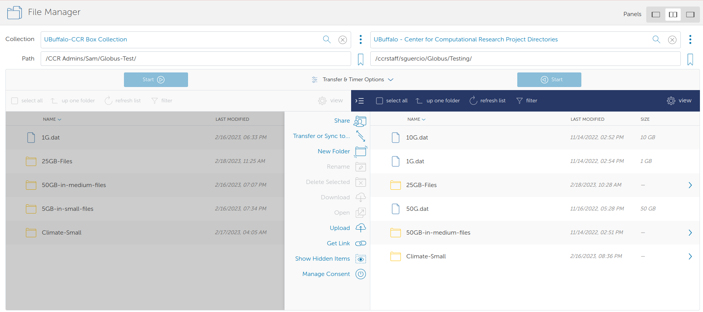

# Data Transfer


CCR supports multiple ways to transfer Data in and out of CCR and the method 
you choose depends on the amount of Data to transfer and the speed of your connection to CCR.
File transfers from a local system can be done through a web-based
application called _Globus_ or through command-line tools such as
secure copy (_scp_), secure ftp (_sftp_) and _rsync_. Some
command-line tools may be unavailable on Windows, though alternative
applications exist. (e.g., Git Bash, FileZilla)


CCR Supported Methods for inbound and outbound Data transfer include:

1. ** [Globus File Transfer Service](#globus-transfers) **

2. ** [Secure Shell Copy (scp/sftp)](#secure-shell-copy) **

3. ** [rclone](#rclone) **

4. ** [OnDemand File Manager App](#ondemand-file-manager-app) **

!!! Warning "VPN Required" 
    Access to Secure Shell Copy and OnDemand is restricted to UB and Roswell Park networks
    (either on campus or connected to their VPN services). [See here](../getting-access.md#vpn-access)

**_ * Globus transfers are available from everywhere, You do not need to be on the UB or Roswell Park networks to use Globus._**

---

## Globus transfers

Globus file transfers are typically initiated through an interactive
web application (command-line access to Globus is also available, but
is beyond the scope of this document). Globus addresses deficiencies
in traditional file-transfer mechanisms by automating large data
transfers, resuming failed transfers, distributing large transfers
across multiple servers, and brokering direct transfers between remote
computing centers. Globus performs an MD5-Checksum for transfer verification.

Globus can be used on macOS, Linux, and Windows operating systems and
is CCR's recommended way of transferring files, especially for large amounts of data.

### Globus Web App
To use Globus, go to the [Globus Web App](https://app.globus.org/) and sign in by
selecting "The State University of New York at Buffalo" from the dropdown menu
and by logging in using your UB credentials.

!!! Note "non-UB users:"
    If you are with an institution other than UB, you will need to [create a Globus account](https://www.globusid.org/create) and contact [CCR Help](../help.md) to map your globusid to your CCR account.



CCR storage resources are available in Globus as mapped collections.
You can connect to a CCR endpoint using the "collections"
field in the Globus web interface and searching for `UBuffalo`

CCR Currently has 4 Mapped Collections:

* UBuffalo - Center for Computational Research Project Directories
* UBuffalo - Center for Computational Research Home Directories
* UBuffalo - Center for Computational Research Global Scratch (/panasas/scratch)
* UBuffalo - Center for Computational Research Vast Global Scratch (/vscratch)  

Log into the endpoint using your UB or RPCI account credentials (not your CCR account). The system will map your @buffalo.edu or roswellpark.org account to your local CCR user and you will have access to the same directories that you do when logged into any other CCR system.  NOTE: Some RPCI accounts will not map correctly to CCR accounts.  If this is affecting you, please contact [CCR Help](../help.md) and we'll resolve the mapping issues.  

You can download single files through the browser but to take advantage of the benefits of Globus you will need to do endpoint to endpoint transfers. To do this, you must configure a local endpoint in order to transfer files to/from your local computer. You can easily set up a Globus endpoint by installing [Globus Connect Personal](https://www.globus.org/globus-connect-personal) and setting up a personal endpoint.

Using the web app, connect your local workstation endpoint with the CCR endpoint and transfer files easily using the Globus
GUI.




### Guest Collections (Globus Shared Endpoints)

Using a Guest Collection (also known as a "Shared Endpoint"), you can share any file or folder that you have access to with anyone who
has a Globus account. This is particularly useful for external collaborations in which data sharing is necessary.  

Detailed information on creating Guest Collections is available at
[docs.globus.org](https://docs.globus.org/how-to/share-files/)

### Using Globus to transfer files to and from UB Box

CCR users are able to move data between CCR and UB Box within Globus using an integrated Box Connector App (UBuffalo-CCR Globus Box Connector). Initial setup will require you to log into UB Box and give the app consent to access UB Box on your behalf.

!!! Note
    The UB Box Collection is accessed the same way the CCR Mapped collections are as described in the [Globus Web App](#globus-web-app) section above with one notable exception: you will be prompted to grant access to UB Box the first time you access the collection.  You will also be prompted to renew the access if it's been awhile since you last connected to UB Box through Globus.

#### Grant Access to the UBuffalo-CCR Globus Box Connector App

*These steps are only needed when accessing the UB Box Collection for the first time:*

Log onto the [Globus Web App](#globus-web-app)

Go to the File Manager tab and search for the "UBuffalo-CCR Box Collection" in the Collection search bar.

When you click on the UBuffalo-CCR Box Collection for the first time, you will be prompted to Authenticate to the UB Box service.



Click `Continue` and you will be directed to the "Registering a Credential" Page. 



This screen shows which Account globus will use to Connect to the CCR UB Box Collection.  
If this is all correct Click `Continue`

You will then be directed to the "Box Login Page"



Verify the account that will be used to log into UB Box is correct and Click `Authorize`

This will take you to the normal UB Single Sign On (SSO) login page where you will log in using your UB credentials and Duo 2 Factor if prompted.

After sucessfully logging into UB SSO you will be prompted with one more screen to Grant access to the "UBuffalo-CCR Globus Box Connector"



Click `Grant access to Box` and you will now be authenticated to your UB Box account from within Globus. You will then be sent back to the File manager screen.

If the panel is blank, you will need to search again for the "UBuffalo-CCR Box Collection" in the Collection search bar. If you have properly granted consent to the Globus Box App, then you should see the contents of your UB Box account.

Once you have completed the Access Consent steps above, you should now be able to access UB Box just like any of the other CCR Mapped Collections.

#### To transfer files to or from UB Box to CCR Collections:

From the File Manager in the second window of the split screen, you can connect to one of the the CCR Mapped collections (ex. UBuffalo - Center for Computational Research Project Directories)
listed above it will appear in the other panel.



From here you can initiate a file transfer by clicking your source files or directories and click `Start`

!!! Note 
    The Box API implements rate limiting so depending on the type of transfer and number of files you may get connection resets in the transfer log. These will not stop the transfer because Globus will just retry the connection until the transfer is complete.

#### Globus Integration with OnDemand  

CCR users may also access Globus using the OnDemand Files app.  For more information [see here](../portals/ood.md#files-app).


## Secure Shell Copy

Command line terminal access is provided via the SSH protocol, while command line file transfer 
is available with `sftp` (Secure File Transfer Protocol) and `scp` (Secure Copy).  [See here](../hpc/login.md#connecting-with-ssh) for more info on using SSH on CCR's systems.   

**to/from the Frontends:**

* This would be for simple file transfers that can complete within a 15 minute timeframe  

**from the Compute Nodes:**

* This would be for file transfers that can complete within a 72 hour window (UB-HPC cluster max, Faculty cluster nodes may have longer max walltime)
* This will only work for outbound transfers because compute nodes are not exposed externally
* You must have an active job with an allocated compute node to get access to the node  

!!! Note "SSH Keys required"
    Users must use SSH keys to connect to CCR servers using SSH/SFTP/SCP.  Please [follow these instructions to upload your public SSH key](../portals/idm.md#ssh-keys) to the CCR identity management portal before attempting to connect to CCR's servers.  

### Command line SCP

The Secure Copy utility, `scp`, can send data to and fetch data from a remote server.

In the examples here, replace `<path-to-file>` with the path of the file you wish to copy, `<username>` with your CCR
username, and `<target-path>` with the full path to the directory you would like to send the file to.

```bash
# Copying files from a local workstation to CCR Frontend Servers

scp -i <path-to-yourSSHKey> <path-to-file> <username>@vortex.ccr.buffalo.edu.edu:<target-path>
```

!!! Note
    For any of the SSH based transfer methods, If you are running an SSH Agent locally that manages your private key you will not need to specify the key in the command line.

Windows users can access scp through PowerShell or [Git bash](https://gitforwindows.org/) or using a GUI application like [FileZilla](#filezilla).

For more information on secure copy take a [look at some of our listed resources](#more-reading) or consult the scp manual page.

### Interactive file transfer with SFTP

The `sftp` utility is an interactive alternative to `scp` that allows multiple, bi-directional transfer operations in a single
session. Within an sftp session, a series of domain-specific file system commands can be used to navigate, move, remove, and copy data
between a local system and CCR resources.

```bash
sftp <username>@vortex.ccr.buffalo.edu
```

We can then use various commands to traverse and manipulate both local and remote file systems.

Command | Function | Example
--------|--------------------------------------------------------------------|----------
cd      | Changes the directory of the remote computer                       | cd remote_directory
lcd     | Changes the directory of the local computer                        | lcd local_directory
ls      | Lists the contents of the remote directory                         | ls
lls     | Lists the contents of the local directory                          | lls
pwd     | Prints working directory of the remote computer                    | pwd
lpwd    | Prints working directory of the local computer                     | lpwd
get     | Copies a file from the remote directory to the local directory     | get remote_file
put     | Copies a file from the local directory to the remote directory     | put local_file
exit    | Closes the connection to the remote computer and exits the program | exit
help    | Displays application information on using commands                 | help

For more information on sftp [check out some of our listed resources](#more-reading) or consult the sftp manual page.

### Rsync

While `scp` is useful for simple file copy operations, the `rsync` utility can be used to synchronize files and directories across two
locations. This can often lead to efficiencies in repeat-transfer scenarios, as rsync only copies files that are different between the
source and target locations (and can even transfer partial files when only part of a file has changed). This can be very useful in reducing
the amount of copies you may perform when synchronizing two datasets.

!!! Warning
    You will need to set the remote shell command to ssh. The default rsh is not secure and will not work at CCR.

In the examples here, replace `<path-to-file>` with the path of the file you wish to copy, `<username>` with your CCR
username, and `<target-path>` with the full path to the directory you would like to send the file to.

```bash
# Synchronizing from a local workstation to CCR

rsync -e 'ssh -i <path-to-yourSSHKey>' -r <path-to-directory> <username>@vortex.ccr.buffalo.edu:<target-path> 
```

**rsync** is not available on Windows by default, but [may be installed individually](https://www.itefix.net/cwrsync) or as part of [Windows
Subsystem for Linux (WSL)](https://docs.microsoft.com/en-us/windows/wsl/install-win10).

For more information on rsync [check out some of our listed resources](#more-reading) or consult the rsync manual page.

### Filezilla

There are additional software products available for Windows, Mac, and Linux distributions that provide secure drag and drop interfaces for file transfer such as Filezilla which can be installed from [here](http://www.buffalo.edu/ubit/service-guides/software/downloading/windows-software/managing-your-software/filezilla.html).

Once installed, follow these steps to connect to CCR resources with Filezilla:

** Adding CCR as a site: **

!!! Note "SSH Keys Required"
    You will need the SSH Key setup in FileZilla so that it does not try and use a password. CCR will only allow SSH key authentication. 

If you are using an SSH Agent to manage your SSH Keys , Verify that your **SSH_AUTH_SOCK** environment variable has been set by the SSH Agent.

```bash
$ echo $SSH_AUTH_SOCK
/run/user/1000/keyring/ssh
```
Open the Filezilla Application

> *  From the File dropdown click `Site Manager...`
 
This will popup the Site Management Window

> * Click `New Site`
> * Rename the site from the default New Site to "CCR"

> * Enter the Following Settings:

      - Protocol: SFTP - SSH File Transfer Protocol
      - Host: vortex.ccr.buffalo.edu
      - Login Type: Normal
      - Username: your-ccr-username
      - Password: Leave Blank

> * Click `OK` to add the site.

After the Site has been added you can connect to CCR by selecting it from the Site Manager Window and clicking `Connect`

**_If you are NOT using an SSH Agent to manage your SSH Keys:_**

Open the Filezilla Application

> * From the Edit dropdown select `Settings` 
> * Go to the `SFTP` Page
> * Click `Add key file...`
> * Navigate to your CCR Private SSH Key and click `Open`

Filezilla will prompt to convert the key into a compatible format

> * Click `yes` and select a place and name for the converted key

You will now see the key in the list of SSH keys

> *  From the File dropdown click `Site Manager...`
 
This will popup the Site Management Window

> * Click `New Site`
> * Rename the site from the default New Site to "CCR"

> * Enter the Following Settings:

      - Protocol: SFTP - SSH File Transfer Protocol
      - Host: vortex.ccr.buffalo.edu
      - Login Type: keyfile
      - Username: your-ccr-username
      - Key file: Navigate to the Key you converted in previous steps

> * Click `OK` to add the site.

After the Site has been added you can connect to CCR by selecting it from the Site Manager Window and clicking `Connect`

## rclone

**rclone** is a tool that can be used to transfer files to/from cloud storage such as Microsoft OneDrive and Box from the command line. The following are instructions on how to use rclone to transfer data to/from OneDrive. For instructions with other cloud storage, check [**rclone** Online documentation](https://rclone.org/docs/)


**rclone** is available as a module at CCR and needs to be loaded in the users environment first.
See [here](../software/modules.md#using-modules) for information on using CCR's modules system.

!!! Note
    OneDrive requires an Internet connected web browser to obtain an authentication token from Microsoft. CCR compute nodes do not have browsers, so you will need access to a machine with rclone and a web browser. **rclone** is available for almost any platform [here](https://rclone.org/downloads/) 


### Using rclone with OneDrive

```bash
$ module load rclone
```

```bash
$ rclone config

No remotes found, make a new one?
n) New remote
s) Set configuration password
q) Quit config
n/s/q> 
```

>> * answer **n** for new remote

> * "**name>**" (the name for the new remote) 
>> * Give it a name such as "OneDrive"

> * "**Storage>**" (the storage type of the new remote)
>> * Select the number that corresponds to "Microsoft OneDrive"

> * "**client_id>**" (OAuth Client Id.) 
>> *  Press Enter to leave empty.

> * "**client_secret>**" (OAuth Client Secret.)
>> *  Press Enter to leave empty.

> * "**region>**"
>> * Press Enter for the default (global).

> * "**Edit advanced config?**"
>> * Enter 'n' No (default)

> * "**Use auto config?**"
>> * Enter 'n' for machine without web browser access

You will then be prompted with the following:
```
Execute the following on the machine with the web browser (same rclone
version recommended):
	rclone authorize "onedrive"
Then paste the result.
Enter a value.
```

As mentioned in the previous Note, You will need to run the authorize command on a system that can open up a browser window which will take you through the authentication steps to access your OneDrive. This includes UB's Single Sign On system if you are a UB Faculty or Staff member.
Once those steps have been completed you can paste the token into the config_token prompt.


> * "**config_token>**"
>> * Paste the token from the authorize step above.

> * "**config_type>**"
>> * Press Enter for the default (onedrive)

> * "**config_driveid>**" (Choose drive to use )
>> *  Select the one that corresponds to OneDrive (business)

> * "**Drive OK?**"
>> * Type "**y**" to confirm the drive you wish to use is correct.

> * "**Keep this "OneDrive" remote?**"
>> * Type "**y**" for Yes this is OK (default)

For additional information on remote setup including additional options see [here](https://rclone.org/remote_setup/)

!!! Error "Security Warning"
    **rclone** stores your access tokens and information about your cloud services in your configuration file. You should keep your rclone.conf file in a secure location with proper permissions set.
    As added protection, we recommend encrypting your configuration file. Information on how to do this can be found [here](https://rclone.org/docs/#configuration-encryption)

To test the connection, create a file with the touch command or copy an existing file to your OneDrive

```
$ touch somefile.txt
$ rclone copy somefile.txt OneDrive:/test
```
This will copy the test file to a test directory, you can verify the copy was successful by using `rclone ls` or logging into OneDrive in a web browser 

```
$ rclone ls OneDrive:/test
0 somefile.txt
```

**Additional rclone information:**

> * [rclone Online documentation](https://rclone.org/docs/)   
> * [rclone OneDrive setup instruction](https://rclone.org/onedrive/)  
> * [rclone Box setup instruction](https://rclone.org/box/)  


## OnDemand File Manager App

This is browser based for simple transfers and not recommended for large amounts of data.  However, OnDemand offers Globus integration to make larger file transfers easier.  For more information see the [OnDemand documentation](../portals/ood.md#files-app)  


<!--
## Transferring Files with UB Box

The UB Information Technology group has recommended using ftps (secure ftp) to transfer files to/from UB Box because 
it is considerably faster than the alternatives.  To use "ftps" (i.e. ftp over SSL), CCR users can use "lftp" on a CCR 
login node (if the transfer will take less than 15 minutes), by running an interactive job or using an OnDemand desktop 
to run for longer periods of time. Prior to doing so, UB users must create an FTP password within Box.  

Please refer the UBit documentation for Using FTP with UBbox found [Here](https://www.buffalo.edu/content/www/ubit/information-for-it-staff-pw/box/ftp.html)

Once your UBbox ftp password is setup, you can transfer files from CCR to UB Box using SFTP. 

To do this, SSH into a CCR Login node and use the following steps substituting in your information:

```bash
$ lftp
lftp :~> set ftps:initial-prot ""
lftp :~> set ftp:ssl-force true
lftp :~> set ftp:ssl-protect-data true
lftp :~> open ftps://ftp.box.com:990
lftp ftp.box.com:~> user UBID@buffalo.edu
Password: _enter_your_box_ftp_password_here_
lftp UBID@buffalo.edu@ftp.box.com:~> ls
drwx------ 1 owner group 0 Mar 24 2020 Your_files
 [...]

lftp UBID@buffalo.edu@ftp.box.com:~> cd somedir
lftp UBID@buffalo.edu@ftp.box.com:/somedir~> get somefile
16063 bytes transferred
lftp UBID@buffalo.edu@ftp.box.com:/somedir~> exit
$ lftp
```

Additional information from Box on using Using Box with FTP or FTPS along with examples is [Here]( https://support.box.com/hc/en-us/articles/360043697414-Using-Box-with-FTP-or-FTPS)
-->


## More reading

* [Indiana University Tutorial on SFTP](https://kb.iu.edu/d/akqg)
* [A Cloud Guru's Tutorial on SSH and SCP](https://acloudguru.com/blog/engineering/ssh-and-scp-howto-tips-tricks)
* [ssh.com's Tutorial on SCP and SFTP](https://www.ssh.com/ssh/sftp/)
* [Linuxize's Tutorial on Rsync](https://linuxize.com/post/how-to-use-rsync-for-local-and-remote-data-transfer-and-synchronization/)
* [Ubuntu's Documentation on Rsync](https://help.ubuntu.com/community/rsync)


---
