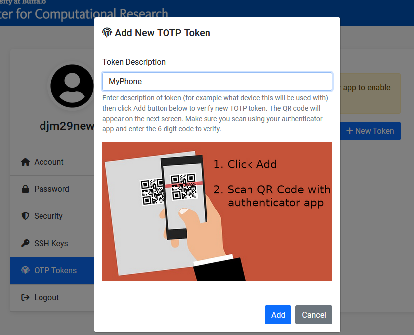
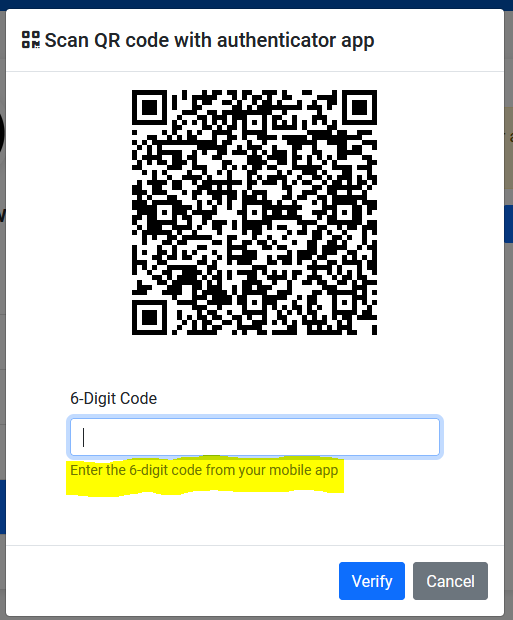
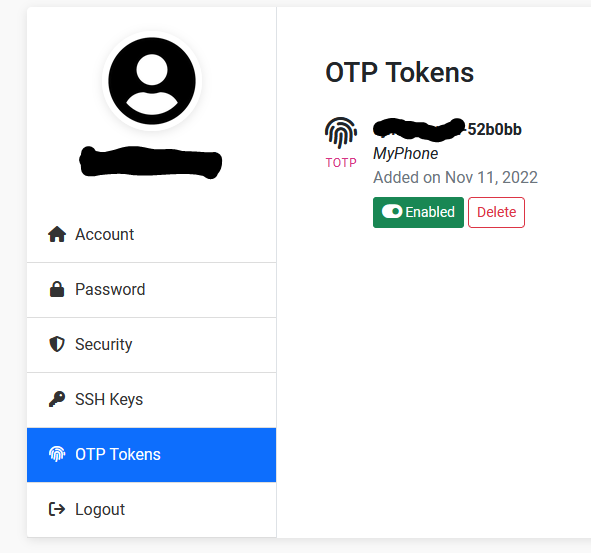
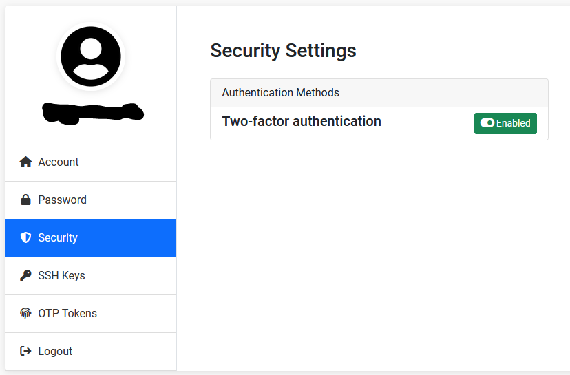

# Identity Management Portal  

The [Identity Management Portal (IDM)](https://idm.ccr.buffalo.edu) provides users with an easy to use interface for the following account management tasks:  


1. [Create a new CCR account](#create-a-ccr-system-account)  
2. [Change your password](#when-you-know-your-password)
3. [Reset your password if it was forgotten](#when-you-forgot-your-password)  
4. [See when your password expires](#password-expiration) and other account information  
5. [Manage two-factor authentication](#managing-two-factor-authentication)  
6. [Manage your public SSH keys](#ssh-keys) to allow for password-less logins to CCR machines   


!!! Warning  
    You must be on the UB or RPCI campuses or connected to the [UB VPN](https://buffalo.edu/ubit) from off campus in order to access CCR's portals.  RPCI users should contact RPCI IT for access to the RPCI VPN.    

## Create a CCR system account  

UB faculty, staff, students, those with a UB volunteer appointment, and those with Roswell Park email addresses are able to create their own CCR account.  

!!! Note  
    We can only accept sign-ups from users affiliated with the University at Buffalo and Roswell Park Comprehensive Cancer Center.  All other users must be either an industry cluster client or collaborating with a UB faculty member and those accounts should be requested through CCR Help.

To create a CCR system account, navigate to the [Identity Management Portal (IDM)](https://idm.ccr.buffalo.edu) and follow these steps:  

1. Click on the `New User? Create Account` link  
2. Fill out the form.  All fields are required. NOTE: you must use your buffalo.edu or roswellpark.org email address.  
3. Review the [Terms of Service](../policies/misuse.md) agreement.  
4. Click the `Create Account` button.  
5. You will be redirected to the `Verify Your Account` page which should display the message `Account created successfully`  This page includes your CCR username and instructions to check your email to activate your account.  If you do not receive this email (check your junk/spam folder!), contact CCR Help for assistance.  
6.  Click on the link in the email which redirects you back to the CCR IDM portal.  Click on the `Verify Account` button to complete the verification process and activate your account.  
7.  You should see the message `Your account has been activated successfully. Thank you` indicating the account has been activated
8.  You will receive a welcome email from CCR with instructions for [enabling two factor authentication](#enabling-two-factor-authentication), which is required, as well as a link to a Getting Started website.    

!!! Danger  
    Your new CCR account doesn't have access to any CCR resources yet.  After enabling 2FA, use **[Coldfront](coldfront.md) - the CCR resource & allocation management portal** - to manage access to CCR's services.  


## Change your CCR password  

### When you know your password  
To change your existing CCR password, login to the [identity management portal](https://idm.ccr.buffalo.edu) and click on the `Password` option on the menu.  Enter your current password, then enter your new password and confirm it before clicking the `Update` button.  

### When you forgot your password  

If you forgot your password or can not login using the password you think you set, navigate to the [identity management portal](https://idm.ccr.buffalo.edu), enter your username and click the `Next` button.  Click the `Forgot password?` link.  You'll be asked for your username and to enter the numbers seen in the captcha picture.  Then click the `Submit` button.  You will see a confirmation message `A reset password email has been sent` and an email will be sent to the email address associated with your CCR account.  When you click on the `Reset your password` button contained in the email you'll be redirected to the IDM portal website to select a new password.  Enter your new password twice and click the `Reset Password` button.  You will be presented with the confirmation message `Your password has been reset successfully` and you'll receive a confirmation email.  

Things to keep in mind:  

- You can only change your password once per hour.  If you attempt to change it more that, you will get an error and will need to wait for the hour to pass before attempting to change it again.
- The link contained in the password reset email is valid for 15 minutes.  
- If you don't receive an email promptly, please check your spam or junk folder.  
- If you click on this link and it doesn't work, try to copy the full URL from the end of the email and paste it in your browser.  
- [See also: Password Requirements](#password-requirements)   

!!! Note  
    If you have two factor authentication enabled, you will be required to enter the OTP code from the authentication app you've associated with your CCR account.  This is a 6 digit code that changes every 30 seconds.  

### Password expiration  

CCR passwords expire annually.  You can check when your password expires by logging into the [identity management portal](https://idm.ccr.buffalo.edu) and clicking on the `Account` option on the menu.  This page also gives you information on what UNIX group your account is a member of and what email address is associated with your CCR account.

If your password is about to expire, set a new one so you don't get locked out.  This can be [done in the IDM portal](#when-you-know-your-password) or you may change your password in the terminal, when logged into one of the cluster login servers.  Use the following commands to get a Kerberos ticket and then change your password.   
```  
ccrkinit
Enter OTP Token Value:   
kpasswd  
Enter OTP Token Value:  
Enter new password:  
Enter it again:  
```  

!!! Tip  
    When prompted for ``OTP Token Value`` you'll need to enter your CCR password plus the 6 digit one-time token from the authentication app linked to your CCR account.  There should be no spaces or extra characters between the password and OTP token.   

### Password Requirements  

You will need to select a strong password (or passphrase) that is at least 8 characters and includes a combination of letters and numbers. For information on selecting a strong password, please visit [UBIT's password website](http://www.buffalo.edu/ubit/service-guides/accounts/your-ubitname-account/managing-your-ubitname-and-password/strong-password.html).  


## Managing Two Factor Authentication  

We require users to have two factor authentication (2FA) enabled on their CCR account.  The only service you'll be able to login without 2FA enabled is the IDM portal so that you're able to link an authentication app to your account.  Once 2FA is enabled, you'll use the IDM portal for managing your 2FA settings and devices.  

!!! Danger  
    The UBIT hardware tokens will NOT work with your CCR account  

### Authentication applications supported for 2FA

Authentication apps that support time-based tokens (TOTP & HOTP) work with CCR accounts.  Options include:  

- **Duo Mobile (for iOS and Android)** - recommended smartphone app as it is currently in use by UBIT for all faculty/staff/student accounts  
- Google Authenticator (for iOS and Android)  
- **_Authy (for iOS, Android, MacOS, Windows, Linux)_** - recommended option for devices other than smartphones  
- FreeOTP (for iOS and Android)  
- Microsoft Authenticator (for Windows phones)  
- Sailfish (SailOTP)  

!!! Tip    
    Install an authentication app FIRST and have it open on your phone or device prior to enabling 2FA on your CCR account  

### Enabling two factor authentication

==**Save time and problems!  Watch this short demo on how to enable 2FA on your CCR account:**==  

  


1. Login to the [identity management portal](https://idm.ccr.buffalo.edu) and click on the `OTP Tokens` menu option  
2. Click on the `New Token` button and enter a description for the new token.  For example, what device this is being connected to.  Then click the `Add` button.  

  
3. In the authentication app on your smartphone or tablet, click or touch to add a new account.  
4. Scan the QR code shown in the CCR IDM portal with your device's camera and update the account name in the app, if desired.  Click `Save` in the authentication app to add the CCR account.  
5. Back in the IDM portal, enter the 6 digit one time token presented in your app, to verify the CCR account has been linked properly with your authentication app.  Do not include any spaces between the numbers.  



If entered correctly, you will see your token listed in the IDM portal and shown as `Enabled`

  

**NOTE:**  If this is the first token added to your CCR account, 2FA will be enabled automatically.  Click on the `Security` menu option to see that 2FA is enabled.  You'll receive an email notifying you that 2FA was enabled for your account.   



!!! Tip  
    If the device you're using doesn't have a camera, click on the `Show URI` link under the QR code displayed in the IDM portal.  This will display a long code.  Copy this code and paste it into your authentication app.  


### Logging in with two factor authentication  

Logins to CCR's portals including OnDemand, ColdFront, Lake Effect cloud, and IDM require us to enter our CCR password and one time token (OTP) from our authentication app in order to authenticate to our accounts.   **You must launch the authentication app on your phone or computer, touch or click on the CCR account, and use the one time token generated to login.**  These tokens regenerate every 30 seconds.  Some authentication apps display the tokens with a space between the first set of 3 digits and the second.  However, there should be no spaces or extra characters between these when you enter this in the box labeled `OTP six digit code` during login.

!!! Warning    
    **THERE ARE NO PUSH NOTIFICATIONS sent from authentication apps for your CCR account.**

Watch this 50 second video for a demo!  


#### WebMO's alternative login  

The login process for WebMO is slightly different than the other CCR portals.  For WebMO you should enter your CCR password and one time token from your authentication app **together in the password box**.   You must launch the authentication app on your phone or computer, touch or click on the CCR account, and use the one time token generated to login.  There should be no spaces or extra characters between the password and OTP token.  

!!! Note  
    These tokens regenerate every 30 seconds. If you're having trouble logging in, wait for the current token to time out and try with the new one generated.  

### Managing tokens for devices  

You may view all OTP tokens linked to your CCR account by clicking on the `OTP Tokens` menu option. This is where you can delete tokens you no longer need or link additional devices to your account.  To add a new device, click on the `New Token` button and scan the QR code or use the URI link as [described above](#enabling-two-factor-authentication).  To delete a token you no longer need or feel may be compromised, click the `Delete` button next to it.  When prompted to confirm, click the `Delete` button again.  If you currently have access to the authentication app associated with this token, you will need to remove it from the app manually.  You'll receive an email notifying you that a new token was added to or a token was removed from your account.  

!!! Warning  
    You will not be allowed to delete the last token on the account as long as 2FA is enabled.  


### Lost access to authentication app  

If you can't login because you no longer have access to the authentication app linked to your CCR account, or somehow the token no longer works, you must contact CCR help to have this reset.  You will be required to prove your identity to us.  Details will be provided by CCR staff.


### Disable two factor authentication  

To disable 2FA on your CCR account, login to the [identity management portal](https://idm.ccr.buffalo.edu) and click on the `Security` menu option.  Click on the `Enabled` button and when prompted to confirm, click the `Disable` button.  You should now see that 2FA is turned off for your account.  You'll receive an email notifying you that 2FA was disabled for your account.    

**REMEMBER**: You will not be able to login to any CCR portals, except IDM, without 2FA enabled!  

!!! Tip  
    Changing phones?  If you won't have access to both devices, disable 2FA on your CCR account prior to swapping phones.  When you get your new phone follow the instructions to [link a new device](#managing-tokens-for-devices) and then [re-enable 2FA](#enabling-two-factor-authentication)  


## SSH Keys  

The IDM portal allows users to manage the SSH public keys associated with their CCR account.  SSH key pairs allow us to login without a password using SSH to CCR's login nodes.  We keep our private key on our local machine and upload the matching public key to our CCR account.  Once uploaded, we can login to any CCR server that supports SSH logins.  If your key pair is ever compromised or lost, you can login to the IDM portal and delete it which will immediately revoke it on all CCR's servers.  

!!! Warning    
    You will not be able to upload SSH keys to the IDM portal unless you have two factor authentication enabled.  

### Creating and using SSH keys  

The creation of a SSH key pair and the method for using it for logins to a linux server are operating system dependent.  We recommend you use your preferred search engine to find one of the many tutorials online for generating and using SSH keys specific to the operating system you're running.  [This site provides everything you could want to know about SSH](https://www.ssh.com/academy).  The CCR cluster login address is `vortex.ccr.buffalo.edu` which is a pool of login servers granting access to our clusters.  

!!! Note    
    Windows users will need to convert the SSH key pair generated into an acceptable OpenSSH format in order to use on CCR's systems.  We recommend using [MobaXterm on Windows](https://mobaxterm.mobatek.net/) for creating, converting, & using SSH keys with your CCR account.  [See below for more details](#special-ssh-key-info-for-windows-users)  

### Add SSH Public Key  

To add your SSH public key to your CCR account, login to the [identity management portal](https://idm.ccr.buffalo.edu) and click on the `SSH Keys` option on the menu.  Click on the `New SSH Key` button to display the `Add New SSH Key` dialog box.  Enter a descriptive title for the key, then copy the contents of your public key file (from your computer) and paste it into the `Public Key` box.  Finally, click the `Add` button.  The title is useful if you have several key pairs stored on different devices.  The title will help you quickly identity these should you need to remove them in the future.  You'll receive an email notifying you of the addition of an SSH key to your account.    

!!! Note
    It can take up to 15 minutes after uploading your public key to the IDM portal to propagate to all CCR servers before you'll be able to login using your private key  

### Permanently remove SSH keys  

If your key pair is ever compromised or you lose access to it, login to the [identity management portal](https://idm.ccr.buffalo.edu) and delete it, **which will immediately revoke it on all CCR's servers**.  To delete your SSH key from your CCR account, click on the `SSH Keys` option on the menu and click the `Delete` button under the key you want to remove.  You'll be prompted to confirm the deletion request.  You'll receive an email notifying you of the removal of an SSH key to your account.  

### Special SSH Key Info for Windows Users  

CCR recommends Windows users utilize MobaXterm for command line cluster access and small file transfers.  We provide information here on SSH key pair management using MobaXterm; however, there is documentation online for various other SSH clients, if you choose to use an alternate package. Much of the information we provide below translates to other SSH client software.   

##### Generate SSH key pair  

To generate a public/private key pair, start the `MobaXterm SSH Key Generator (MobaKeyGen)` found under the MobaXterm Tools menu.  Under 'type of key to generate' select ED25519.  Click the Generate button and move your mouse around the empty area at the top of the GUI.  As you move your mouse around, you'll see the bar move across the window indicating it's working on generating your random, unique key.

##### Export key pair  

Once the key generation is complete you'll need to save your public and private keys onto your computer.  Before doing so you might want to consider:

- For the utmost in security, you can enter a passphrase for your private key.  This is helpful if your machine is compromised and your key is stolen, the hacker would need the passphrase associated with the key to utilize it.  Every time you use the key, you will need to enter the passphrase.   We don't require it but do recommend it.  If you choose to set one, enter it in the `Key passphrase` box and re-enter it in the `Confirm passphrase` box.  
- Changing the default `Key comment` may be desirable to you.  Most people enter their email address here or you can enter something that reminds you this was generated for CCR use or what machine you used to generate it on.  This is also optional.

  

If you've chosen not to save a key passphrase you will be asked again if you're sure.  Click `Yes` or go back and add a key passphrase.

You will be prompted to select a location to save the private key.  **The file location of the private key MUST be a place that only you have access to.  Do not store this on a shared file system or a folder on your computer that is shared.**   

!!! Note  
    Make sure to save the key with an extension of .ppk - if you don't this won't work when trying to connect using MobaXterm or FileZilla  

Finally, click the `Save public key` button. We recommend you save it with the same name as your private key but ending in .pub.  Before you close this window, you can copy the text from the box labeled `Public key for pasting into OpenSSH server` and paste that into the SSH box in CCR's identity management portal, as [described above](#add-ssh-public-key)
